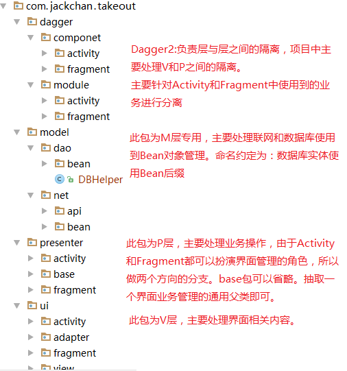

# 外卖客户端

- Git服务器，客户端的搭建与使用
- MVP+Retrofit+Okhttp+Dagger2组织项目架构
- 充分运用Android5.0，6.0新增控件实现UI效果。
- 用户登录，短信验证码注册，登录状态保存，
- 地址管理，UI及数据的增删改查
- 支付宝完成订单支付
- 高德地图与外卖业务的高度集成
- APP的善后工作
- 友盟数据统计
- APK瘦身（代码混淆，图片压缩等）
- 多渠道打包
- apk加固
- 增量更新
- 热修复
